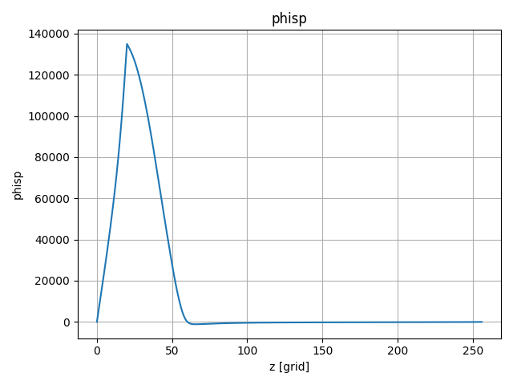
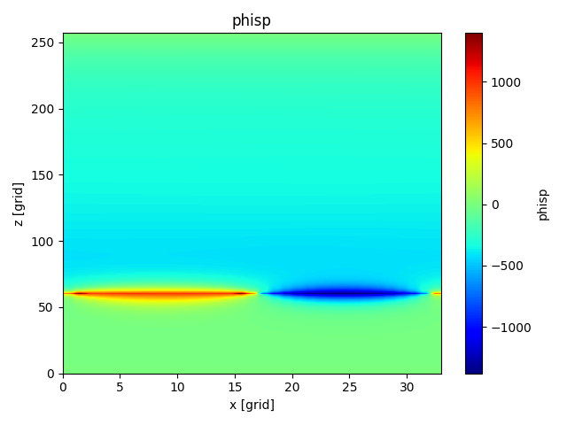
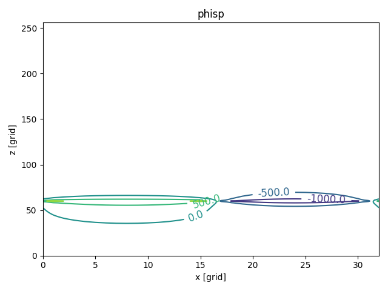
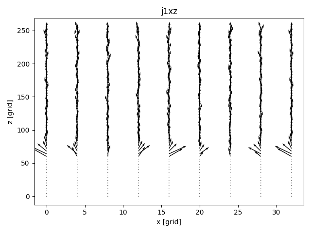
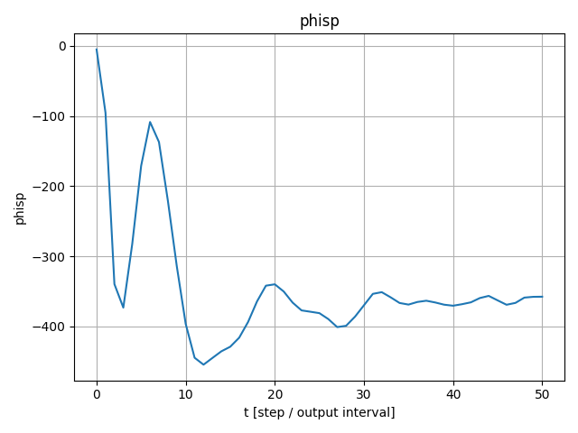

# visualization-codes-for-EMSES
Basic plotting scripts for EMSES output data.

## Configuration Setting
Run a script to build a visualization configuration when cloned for the first time.

Install pip, matplotlib, numpy, h5py, ipython and mpi4py.

```
git clone https://github.com/Nkzono99/visualization-codes-for-EMSES.git
cd visualization-codes-for-EMSES
source configuration.sh
```

## 1D visualization
```
python plot_line1d.py <directory> -dn phisp --axis z -x 16 -y 16 -i -1
```


## 2D colormap visualization
```
python plot_cmap2d.py <directory> -dn phisp --axis xz -y 16 -i -1
```


## 2D contour visualization
```
python plot_contour2d.py <directory> -dn phisp --axis xz -y 16 -i -1
```


## 2D vector visualization
```
python plot_vector2d.py <directory> -dn j1 --axis xz -y 16 -i -1
```


## 1D timeseries visualization
```
python plot_timeseries.py <directory> -dn phisp -x 16 -y 16 -z 16
```

